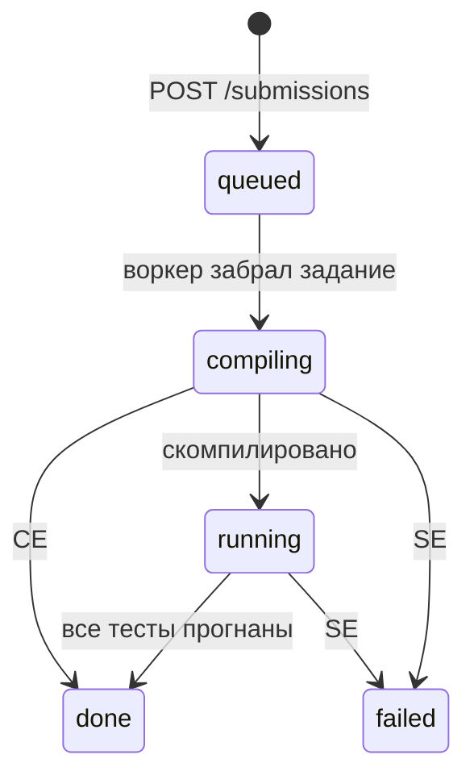
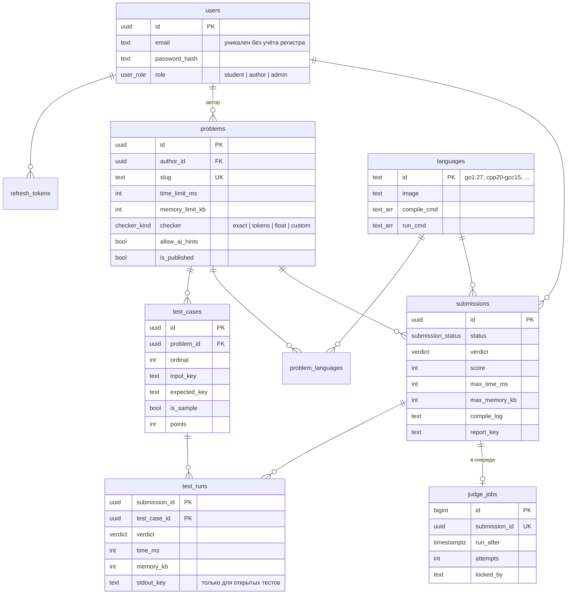

# База данных и жизненный цикл посылки

Общая архитектура системы: [infra/docs/architecture.md](https://github.com/autocheck-team/infra/blob/main/docs/architecture.md).

## Жизненный цикл посылки

`failed` означает сбой самой системы (вердикт `SE`), а не ошибку студента. Такую посылку
можно перепроверить. Ограничение в БД гарантирует, что у посылок в статусах `done` и
`failed` вердикт всегда заполнен.

Вердикты: `OK`, `CE` — ошибка компиляции, `WA` — неверный ответ, `TL` — превышено время,
`ML` — превышена память, `RE` — ошибка выполнения, `SE` — сбой системы.

## Схема БД

Миграции: [`internal/db/migrations`](../internal/db/migrations).

Таблицы для платных функций (тарифы, подписки, счётчики лимитов) и ИИ-функций появятся
в своих задачах (HPRPR-12 и далее) отдельными миграциями.
